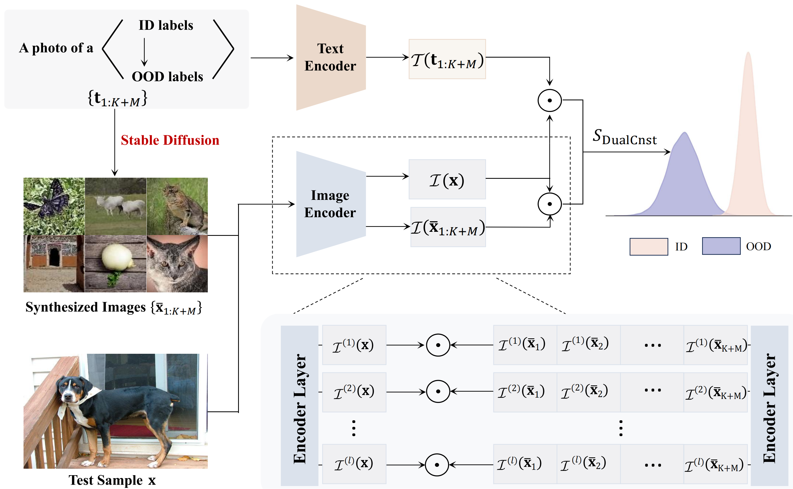
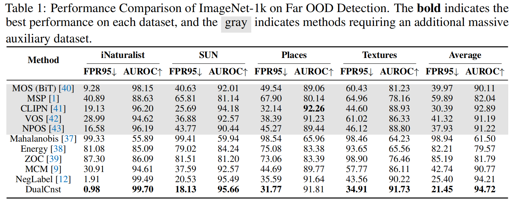

# DualCnst: Enhancing Zero-Shot Out-of-Distribution Detection via Text-Image Consistency in Vision-Language Models

[](https://neurips.cc/)  [](https://www.python.org/downloads/)  [](https://pytorch.org/)  [](https://opensource.org/licenses/MIT)

Official PyTorch implementation for the paper: **DualCnst: Enhancing Zero-Shot Out-of-Distribution Detection via Text-Image Consistency in Vision-Language Models** (NeurIPS 2025)

---

## Abstract

Pretrained vision-language models (VLMs), such as CLIP, have shown promising zero-shot out-of-distribution (OOD) detection capabilities by leveraging semantic similarities between input images and textual labels. However, most existing approaches focus solely on expanding the label space in the text domain, ignoring complementary visual cues that can further enhance discriminative power.

In this paper, we introduce DualCnst, a novel framework that integrates text-image dual consistency for improved zero-shot OOD detection. Specifically, we generate synthetic images from both ID and mined OOD textual labels using a text-to-image generative model, and jointly evaluate each test image based on (i) its semantic similarity to class labels and (ii) its visual similarity to the synthesized images. The resulting unified score function effectively combines multimodal information without requiring access to in-distribution images or additional training.

We further provide theoretical analysis showing that incorporating multimodal negative labels reduces score variance and improves OOD separability. Extensive experiments across diverse OOD benchmarks demonstrate that DualCnst achieves state-of-the-art performance while remaining scalable, data-agnostic, and fully compatible with prior text-only VLM-based methods.

## Illustration



---

## Checkpoints

We use publicly available pre-trained models from Hugging Face and Stability AI:

### CLIP Models

Our reported results are based on CLIP checkpoints from Hugging Face:

- **CLIP ViT-B/32**: [openai/clip-vit-base-patch32](https://huggingface.co/openai/clip-vit-base-patch32)
- **CLIP ViT-B/16**: [openai/clip-vit-base-patch16](https://huggingface.co/openai/clip-vit-base-patch16)
- **CLIP ViT-L/14**: [openai/clip-vit-large-patch14](https://huggingface.co/openai/clip-vit-large-patch14)

Alternatively, you can use the original checkpoints from [OpenAI's CLIP repository](https://github.com/openai/CLIP), which yield similar results.

### Stable Diffusion Model

For image generation in the DualCnst scoring method, we use Stable Diffusion XL Turbo:

- **SDXL-Turbo**: [stabilityai/sdxl-turbo](https://huggingface.co/stabilityai/sdxl-turbo)

This model is automatically downloaded when running the image generation script (`utils/generation_image_SDXLTurbo.py`).

**Note**: All models are automatically downloaded on first use. Ensure you have sufficient disk space (~10GB for CLIP models, ~7GB for SDXL-Turbo).

---

## Installation

### Environment Setup

This project requires **two separate conda environments**:

1. **`ood`** environment - For OOD label selection and detection inference
2. **`sd`** environment - For image generation using Stable Diffusion


#### Step 1: Create the OOD Environment

```bash
# Create ood environment from configuration file
conda env create -f ood.yml

# Activate the environment
conda activate ood
```


#### Step 2: Create the SD Environment

```bash
# Create sd environment from configuration file
conda env create -f sd.yml

# Activate the environment
conda activate sd
```


#### Manual Installation

You can install manually:

```bash
# OOD Environment
conda create -n ood python=3.8
conda activate ood
pip install torch==2.7.1+cu118 torchvision==0.22.1+cu118 --extra-index-url https://download.pytorch.org/whl/cu118
pip install git+https://github.com/openai/CLIP.git
pip install transformers scipy scikit-learn matplotlib seaborn pandas tqdm

# SD Environment
conda create -n sd python=3.10
conda activate sd
pip install torch==2.7.1+cu118 torchvision==0.22.1+cu118 --extra-index-url https://download.pytorch.org/whl/cu118
pip install diffusers transformers accelerate modelscope
```

---

## Data Preparation

### Directory Structure

Create the following directory structure:

```
DualCnst/
├── datasets/
│   ├── ImageNet/              # ImageNet-1K (ILSVRC-2012)
│   │   ├── train/
│   │   └── val/
│   ├── ImageNet10/            # Generated subset
│   ├── ImageNet20/            # Generated subset
│   ├── ImageNet100/           # Generated subset
│   └── ImageNet_OOD_dataset/
│       ├── iNaturalist/
│       ├── SUN/
│       ├── Places/
│       └── dtd/
├── OODNegMining/              # Generated OOD label files
└── similarity_caches/         # Feature caches (auto-generated)
```

### In-Distribution Datasets

We consider the following ID datasets:

1. **ImageNet-1K**: Download from [ImageNet ILSVRC-2012](https://image-net.org/challenges/LSVRC/2012/)
2. **ImageNet Subsets** (ImageNet-10, ImageNet-20, ImageNet-100): Generated from ImageNet-1K
3. **Fine-grained datasets** (auto-downloaded on first use):
   - [CUB-200-2011](http://www.vision.caltech.edu/datasets/cub_200_2011/) (bird200)
   - [Stanford Cars](http://ai.stanford.edu/~jkrause/cars/car_dataset.html) (car196)
   - [Food-101](https://data.vision.ee.ethz.ch/cvl/datasets_extra/food-101/) (food101)
   - [Oxford-IIIT Pet](https://www.robots.ox.ac.uk/~vgg/data/pets/) (pet37)

#### Creating ImageNet Subsets

Generate ImageNet-10, ImageNet-20, and ImageNet-100 from ImageNet-1K:

```bash
conda activate ood

# ImageNet-10 (mimics CIFAR-10 distribution)
python create_imagenet_subset.py --in_dataset ImageNet10 --src-dir datasets/ImageNet --dst-dir datasets

# ImageNet-20 (semantically similar to ImageNet-10, for hard OOD)
python create_imagenet_subset.py --in_dataset ImageNet20 --src-dir datasets/ImageNet --dst-dir datasets

# ImageNet-100
python create_imagenet_subset.py --in_dataset ImageNet100 --src-dir datasets/ImageNet --dst-dir datasets
```


### Out-of-Distribution Datasets

Download the large-scale OOD test datasets curated by [Huang et al. 2021](https://arxiv.org/abs/2105.01879):

- [iNaturalist](https://arxiv.org/abs/1707.06642)
- [SUN](https://vision.princeton.edu/projects/2010/SUN/)
- [Places](https://arxiv.org/abs/1610.02055)
- [Texture (DTD)](https://arxiv.org/abs/1311.3618)

Follow instructions from [this repository](https://github.com/deeplearning-wisc/large_scale_ood#out-of-distribution-dataset) to download the subsampled versions (semantically overlapped classes with ImageNet-1K removed).

Place all OOD datasets in `datasets/ImageNet_OOD_dataset/`.

---

## Quick Start

### Automated Pipeline (Recommended)

We provide a fully automated pipeline that handles the complete workflow with automatic environment switching.

#### Usage

```bash
# Activate the ood environment (pipeline will handle sd environment automatically)
conda activate ood

# Run the complete pipeline
bash scripts/run_full_pipeline.sh <dataset> <score> [experiment_name] [options]
```

#### Examples

```bash
# Basic usage: ImageNet with DualCnst score
bash scripts/run_full_pipeline.sh ImageNet DualCnst

# With experiment name
bash scripts/run_full_pipeline.sh ImageNet DualCnst my_experiment

# Skip label generation if already exists
bash scripts/run_full_pipeline.sh ImageNet DualCnst exp1 --skip-label-generation

# Different datasets
bash scripts/run_full_pipeline.sh ImageNet10 DualCnst
```


### Manual Step-by-Step Execution

If you prefer manual control over each step:

#### Step 1: OOD Label Selection

```bash
conda activate ood

# Select OOD labels for ImageNet
python OODNegMining/select_neglabel_cli.py --dataset ImageNet
```


#### Step 2: Image Generation

```bash
conda activate sd

# Generate images (ensure generation_image_SDXLTurbo.py is configured for your dataset)
python utils/generation_image_SDXLTurbo.py
```

**Note**: You may need to modify `generation_image_SDXLTurbo.py` to specify the dataset and output directory.

#### Step 3: OOD Detection Inference

```bash
conda activate ood

# Run evaluation
bash scripts/eval_dualcnst.sh <experiment_name> <dataset> <score>

# Example
bash scripts/eval_dualcnst.sh eval_ood ImageNet DualCnst
```

Or use the Python script directly:

```bash
python eval_ood_detection.py \
    --name my_experiment \
    --in_dataset ImageNet \
    --score DualCnst \
    --CLIP_ckpt ViT-B/16 \
    --gpu 0
```
---

## Results

### ImageNet-1K Main Results

Our method achieves state-of-the-art performance on ImageNet-1K OOD detection across multiple OOD test datasets:

<div align="center">
  
</div>

### Performance Metrics

We evaluate OOD detection performance using three standard metrics:

- **AUROC** (Area Under ROC Curve) ↑: Higher is better
- **AUPR** (Area Under Precision-Recall Curve) ↑: Higher is better
- **FPR95** (False Positive Rate at 95% True Positive Rate) ↓: Lower is better


---
## Citation

If you find this work helpful, please consider citing our paper:

```bibtex
@inproceedings{dualcnst2025,
  title={DualCnst: Enhancing Zero-Shot Out-of-Distribution Detection via Text-Image Consistency in Vision-Language Models},
  author={Your Name and Co-authors},
  booktitle={Advances in Neural Information Processing Systems},
  year={2025}
}
```
## Acknowledgments

This work builds upon several excellent open-source projects:
- [CLIP](https://github.com/openai/CLIP) - Vision-language pre-training by OpenAI
- [MCM](https://github.com/deeplearning-wisc/MCM) - Maximum Concept Matching for OOD detection
- [NegLabel](https://github.com/tmlr-group/NegLabel) - Negative label-based OOD detection

We thank the authors for their excellent work and contributions to the community.
